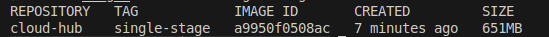
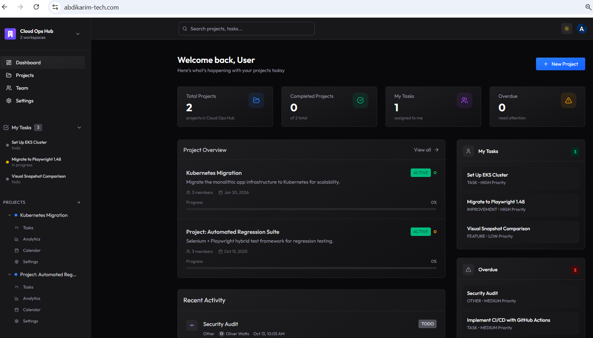
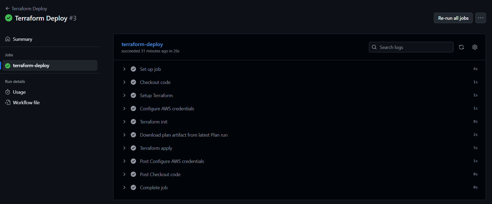

# Cloud Ops Hub: End-to-End Infrastructure Deployment on AWS ECS

## Table of Contents

- [Project Overview](#project-overview)
- [Project Structure](#project-structure)
- [Architecture Overview](#architecture-overview)
- [Key Features](#key-features)
- [Infrastructure Components](#infrastructure-components)
- [Docker Implementation](#docker-implementation)
- [Terraform Design Patterns](#terraform-design-patterns)
- [CI/CD Pipeline](#cicd-pipeline)
- [Monitoring](#monitoring)
- [Security Highlights](#security-highlights)
- [Prerequisites](#prerequisites)
- [Quick Start](#quick-start)
- [Future Enhancements](#future-enhancements)
- [Deployment Visuals](#deployment-visuals)

## Project Overview

A production-grade deployment of a Cloud Ops Hub platform on AWS ECS Fargate, provisioned using Terraform and deployed through GitHub Actions. The setup includes a multi-AZ VPC, secure HTTPS routing via Application Load Balancer, scalable ECS Fargate tasks, ACM-managed certificates, CloudWatch monitoring with SNS alerts, and automated CI/CD pipelines for both application builds and infrastructure changes.


## Project Structure

```
.
├── .github/workflows/       # CI/CD pipelines (build, plan, deploy)
├── app/                     # Application source code
├── docker/                  # dockerfile
├── images/                  # Architecture diagrams and screenshots
├── infra/                   # Terraform root module
│   ├── modules/             # Reusable modules (vpc, ecs, alb, etc.)
│   ├── backend.tf           # S3 backend configuration
│   ├── locals.tf            # Subnet mappings and local values
│   ├── main.tf              # Module composition
│   ├── remote_state.tf      # S3 bucket and DynamoDB table for state management
│   └── variables.tf         # Input variables
└── README.md
```

## Architecture Overview

**Two-tier, multi-AZ architecture** deployed in AWS eu-north-1 region:

### Tier 1: Public Subnet (ALB Tier)
- Application Load Balancer with SSL/TLS termination (ACM)
- NAT Gateways for outbound internet access
- Spans two Availability Zones (eu-north-1a, eu-north-1b)

### Tier 2: Private Subnet (Application Tier)
- ECS Fargate services running Docker containers
- No direct internet access for enhanced security
- High availability across two AZs

### Traffic Flow
```
User → Cloudflare → Route 53 → Internet Gateway → ALB → ECS Services
```

### Deployment Flow
```
Application: GitHub Actions → Docker Build → Trivy Scan → Container Test → ECR → SSM Parameter → ECS Update
Infrastructure: GitHub Actions → Terraform Plan → Manual Review → Terraform Apply
```

## Key Features

### High Availability & Reliability
- Multi-AZ deployment across eu-north-1a and eu-north-1b
- Application Load Balancer with health checks
- Redundant NAT Gateways per AZ

### Security
- SSL/TLS encryption with AWS Certificate Manager
- Private subnets for application tier
- Container vulnerability scanning with Trivy
- Infrastructure compliance scanning with Checkov
- IAM roles with OIDC (no long-lived credentials)

### Infrastructure as Code
- 100% Terraform-managed infrastructure with modular design
- DRY principles using `for_each` for subnet creation
- Remote state management (S3 + DynamoDB locking)
- Versioned, encrypted state with object lock enabled

### Automation & CI/CD
- Automated builds and deployments via GitHub Actions
- Dynamic image tagging using Git SHA
- SSM Parameter Store for zero-downtime deployments
- Automated infrastructure validation and security scanning

### Monitoring & Observability
- CloudWatch Log Groups for debugging
- CloudWatch Alarms monitoring CPU utilization (80% threshold)
- SNS notifications for alarm triggers

## Infrastructure Components

**AWS Services:** VPC, ECS (Fargate), ECR, ALB, Route 53, ACM, NAT Gateway, Internet Gateway, CloudWatch, SNS, SSM Parameter Store, S3, DynamoDB

**External Services:** Cloudflare (Domain), GitHub Actions (CI/CD), Trivy (Security Scanning), Checkov (IaC Scanning)

## Docker Implementation

### Multi-Stage Build Strategy

The application uses a multi-stage Docker build for optimal image size and security:

**Build Stage:** Node.js for building the application
**Production Stage:** Nginx Alpine with non-root user for minimal runtime and reduced attack surface

### Best Practices Implemented

1. **Image Size Optimization**
   - Multi-stage builds separate build and runtime
   - Alpine Linux base for minimal footprint
   - Production stage only includes built artifacts

2. **Security Enhancements**
   - Non-root user (nonroot) for container security
   - Minimal runtime dependencies
   - Nginx hardening with proper permissions

3. **Build Efficiency**
   - Layer caching optimization
   - Only necessary files in production image

### Image Size Results

**Before Optimization:** 651 MB (single-stage build)
**After Optimization:** 54.5 MB (multi-stage build)
**Size Reduction:** 91.6% improvement

#### Visual Proof of Optimization

**Single-Stage Build:**



**Multi-Stage Build:**


## Terraform Design Patterns

### DRY Principles
Instead of repeating subnet resources, I created a map-based approach:
- Define subnets as `map(object)` variables with CIDR and AZ attributes
- Use `for_each` in VPC module to dynamically create subnets
- Pass subnet configurations via `locals.tf` in root module

### Modular Architecture
Separate modules for each AWS service enable reusability and maintainability. All values passed via `terraform.tfvars` for environment-specific customization.

### State Management
- **S3 Backend:** Versioned, encrypted, with object lock (governance mode)
- **DynamoDB:** State locking prevents concurrent modifications
- Enables team collaboration and disaster recovery

## CI/CD Pipeline

The CI/CD pipeline orchestrates the entire deployment process, automating both containerization and infrastructure provisioning through GitHub Actions.

### Build Pipeline
Triggered on push to `app/` or `docker/` directories:
1. Checkout code and authenticate to AWS via OIDC
2. Build Docker image tagged with Git SHA (7 characters)
3. Run Trivy vulnerability scanner (blocks on CRITICAL/HIGH)
4. Test container health
5. Push image to ECR
6. Update SSM Parameter Store with new tag

**Key Innovation:** ECS task definition dynamically pulls image tag from SSM Parameter Store, enabling zero-downtime deployments without Terraform changes.

### Terraform Plan Pipeline
Triggered on push to `infra/` directory:
1. **Static Analysis:** terraform fmt, validate, and tflint
2. **Security Scanning:** Parallel Trivy and Checkov scans using GitHub Actions matrix strategy
3. **Plan Generation:** Creates execution plan and uploads artifact

### Terraform Deploy Pipeline
Manual trigger after plan review - applies approved infrastructure changes.

## Monitoring

**CloudWatch Logs:** Centralized logging for all ECS tasks

**CloudWatch Alarms:** 
- Average CPU utilization monitoring
- Triggers SNS notification at 80% threshold
- Can be extended for auto-scaling decisions

**SNS Topics:** Email/SMS notifications for infrastructure alerts

## Security Highlights

- **Network Isolation:** Application tier in private subnets
- **Encryption:** SSL/TLS via ACM, encrypted Terraform state
- **Vulnerability Management:** Automated scanning in CI/CD
- **Compliance:** Checkov validates Terraform against AWS best practices
- **Secrets Management:** GitHub Secrets + SSM Parameter Store

## Prerequisites

- Terraform >= 1.5.0
- AWS Account with appropriate IAM roles
- Domain registered (Cloudflare)
- GitHub repository with configured secrets
- Docker for local testing

## Quick Start

### 1. Clone Repository
```bash
git clone <repository-url>
cd <repository-name>
```

### 2. Setup AWS Backend
Create S3 bucket and DynamoDB table for Terraform state management:
```bash
aws s3api create-bucket \
  --bucket <your-terraform-state-bucket> \
  --region eu-north-1 \
  --create-bucket-configuration LocationConstraint=eu-north-1

aws s3api put-bucket-versioning \
  --bucket <your-terraform-state-bucket> \
  --versioning-configuration Status=Enabled

aws dynamodb create-table \
  --table-name terraform-state-lock \
  --attribute-definitions AttributeName=LockID,AttributeType=S \
  --key-schema AttributeName=LockID,KeyType=HASH \
  --billing-mode PAY_PER_REQUEST \
  --region eu-north-1
```

### 3. Configure Terraform Variables
```bash
cd infra
cp terraform.tfvars.example terraform.tfvars
# Edit terraform.tfvars with your values
```

### 4. Initialize and Deploy Infrastructure
```bash
terraform init
terraform plan
terraform apply
```

### 5. Local Docker Testing (Optional)
```bash
# From repository root
docker build -f docker/dockerfile -t cloud-ops-app .
docker run -p 80:80 cloud-ops-app
```

### 6. Deploy Application
Push changes to `app/` or `docker/` directories to trigger the build pipeline automatically.

## Future Enhancements

- Implement ECS Service auto-scaling based on CloudWatch metrics
- Add AWS WAF for additional application security
- Implement blue-green or canary deployment strategies
- Multi-region deployment for disaster recovery

## Deployment Visuals

### Live Application


### Build & Push Pipeline


### Terraform Plan Pipeline


### Terraform Deploy Pipeline



